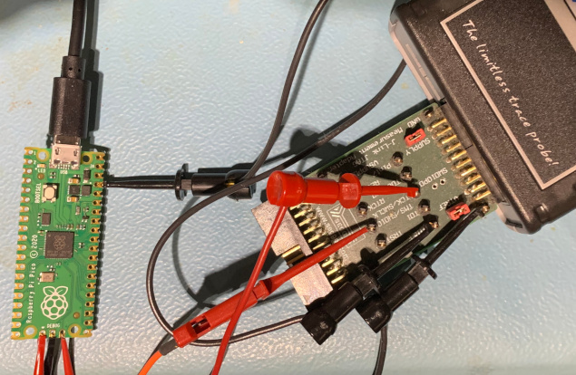

# how to compile

Install Zephyr as explained [here](https://docs.zephyrproject.org/latest/develop/getting_started/index.html), with a local environment.

# how to build

From the terminal in Visual Studio Code, or set the environment variable `ZEPHYR_BASE` to `~/zephyrproject/zephyr` (is set automatically from `.vscode/settings.json` in the VS Code terminal). Then switch to the virtual environment:

```
source ~/zephyrproject/.venv/bin/activate
```

and build it:

```
west build -p always
```

# how to flash

The resulting file `./build/zephyr/zephyr.uf2` can be copied in boot mode as usual to the RP Pico.

If you connect a JLink to the RP Pico, you can flash it like this:

```
west -v flash --runner jlink
```

# how to debug

A JLink also allows to debug it. Alternatively you can use a second RP Pico and debug it with openocd, as explained [here](https://docs.zephyrproject.org/3.1.0/boards/arm/rpi_pico/doc/index.html). For this you need to change the `.vscode/settings.json` file accordingly.

# JLink hardware connection

Connect SWDIO, SWCLK, GND to the same pins of the JLink, and 3.3V of the RP Pico to VTREF of the JLink. Then power up the RP Pico from external USB (can be just a power supply, doesn't need to be connected to a computer).

Example setup:

